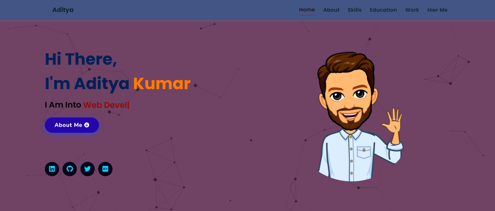

# Aditya Kumar - Personal Portfolio Website

A modern, responsive portfolio website showcasing my skills, projects, and experience as a Full-Stack Developer specializing in AI/ML and web development.


## 🌟 Features

- **Responsive Design**: Works seamlessly across all devices (desktop, tablet, mobile)
- **Interactive UI**: Smooth animations, particle effects, and hover interactions
- **Project Showcase**: Dedicated projects page with filtering capabilities
- **Skills Display**: Dynamic skills section with icons and animations
- **Contact Form**: Functional contact form with EmailJS integration
- **Modern Styling**: Clean, professional design with gradient backgrounds
- **Fast Loading**: Optimized images and efficient code structure

### Hosting & Deployment
- **Vercel**: Cloud platform for deployment
- **Git**: Version control

## 📁 Project Structure

```
Aditya_website/
├── index.html                 # Main homepage
├── LICENSE                    # MIT License
├── skills.json               # Skills data
├── vercel.json               # Vercel deployment config
├── assets/
│   ├── css/
│   │   └── style.css         # Main stylesheet
│   ├── images/               # All project images
│   │   ├── aditya w-Photoroom.jpg
│   │   ├── hero1-Photoroom.png
│   │   ├── favicon.png
│   │   ├── educat/           # Education images
│   │   ├── projects/         # Project screenshots
│   │   └── skills/           # Skill icons
│   └── js/
│       ├── app.js            # Particles.js configuration
│       ├── particles.min.js  # Particles library
│       └── script.js         # Main JavaScript functionality
└── projects/
    ├── index.html            # Projects page
    ├── projects.json         # Projects data
    ├── script.js            # Projects page functionality
    └── style.css            # Projects page styling
```

## 🚀 Live Demo

[View Live Portfolio](https://aditya-portfolio-website.vercel.app)

## 📱 Screenshots

### Desktop View



## 🔧 Installation & Setup

1. **Clone the repository**
   ```bash
   git clone https://github.com/TechAditya01/Aditya_website.git
   cd Aditya_website
   ```

2. **Open locally**
   ```bash
   # Using a local server (recommended)
   python -m http.server 8000
   # or
   npx serve .
   ```

3. **Access the website**
   Open `http://localhost:8000` in your browser


## 🤝 Contributing

1. Fork the repository
2. Create a feature branch (`git checkout -b feature/AmazingFeature`)
3. Commit your changes (`git commit -m 'Add some AmazingFeature'`)
4. Push to the branch (`git push origin feature/AmazingFeature`)
5. Open a Pull Request

## 👤 Author

**Aditya Kumar**
- 🎓 B.Tech CSE (AI & ML) - Rungta College of Engineering & Technology
- 📍 Bhilai, India
- 📧 adityakumar.gdscrcet@gmail.com
- 💼 [LinkedIn](https://www.linkedin.com/in/aditya-kumar-46bb7524b/)
- 🐙 [GitHub](https://github.com/TechAditya01)
- 🐦 [Twitter](https://x.com/KumarAdity47357)
- 📝 [Dev.to](https://dev.to/aditya_kumar_1ed587da5d8f)

## 📄 License

This project is licensed under the MIT License - see the [LICENSE](LICENSE) file for details.

⭐ **If you like this project, please give it a star!** ⭐
